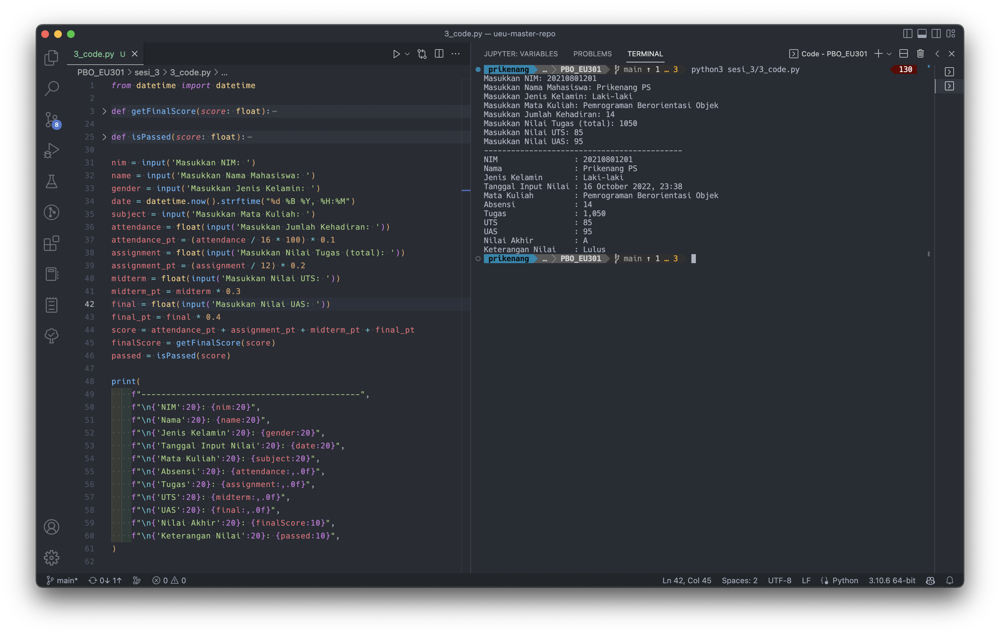

Buatlah program sederhana dengan control flow statement. Program harus memiliki
variable sebagai berikut:

NIM, Nama Mahasiswa, Jenis Kelamin, Tanggal Input Nilai, Nama Mata kuliah, Absensi,
Tugas, UTS, Dan UAS, Nilai Akhir, Keterangan Nilai (Lulus/Tidak Lulus).

Logika Algoritma: Berikan rumus presentase pada grade nilai tersebut dan buat logika
algoritmauntuk menampilkan nilai Akhir

- 0 - 49 (Grade E),
- 50 - 59 (Grade D),
- 60 - 63,9 (Grade C),
- 64 - 67.9 (Grade C+),
- 68 - 70.9 (Grade B-),
- 71 - 73.9 (Grade B),
- 74 - 76.9 (Grade B+),
- 77 - 79.9 (Grade A-),
- 80 - 100 (Grade A).

[source code](3_code.py)

