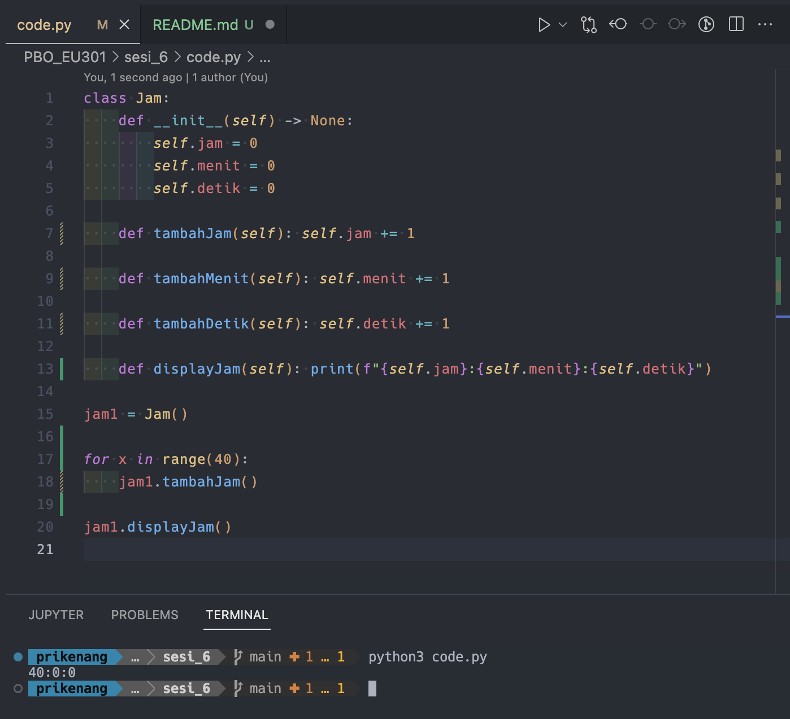
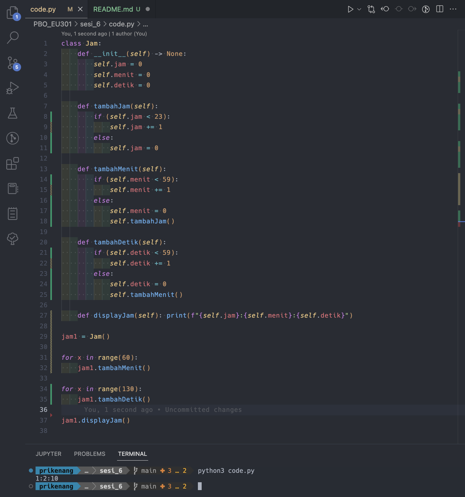

### Lihat Modul Studi Kasus Kelas Jam pada materi.
Pertanyaan:
1. Apakah bisa jam bernilai 40? Modifikasi program agar nilai jam antara 0-23, menit 0-59, dan detik 0-59.
2. Jelaskan bagaimana abstraksi dan enkapsulasi diterapkan pada Kelas Jam
berdasarkan poin 1.

Tulis jawaban Anda dalam file pdf dan upload sebelum batas waktu yang telah ditentukan.

---
Jawaban:
1. Apakah bisa jam bernilai 40? Bisa

Modifikasi program agar nilai jam antara 0-23, menit 0-59, dan detik 0-59.

2. Jelaskan bagaimana abstraksi dan enkapsulasi diterapkan pada Kelas Jam berdasarkan poin 1.

Abstraksi secara default memang tidak tersedia di bahasa pemrograman Python. Akan tetapi terdapat sebuah modul yang dapat digunakan sebagai <i>base</i> dalam mendefinisikan Abstract. Dijelaskan dengan penggunaan class Time sebagai Abstract. [code](code.py)

Enkapsulasi diterapkan dengan membuat method `displayJam` yakni menampilkan jam, menit, dan detik sebagai string dengan format tertentu sehingga variabel jam, menit, dan detik tidak dapat diakses langsung dari luar class.