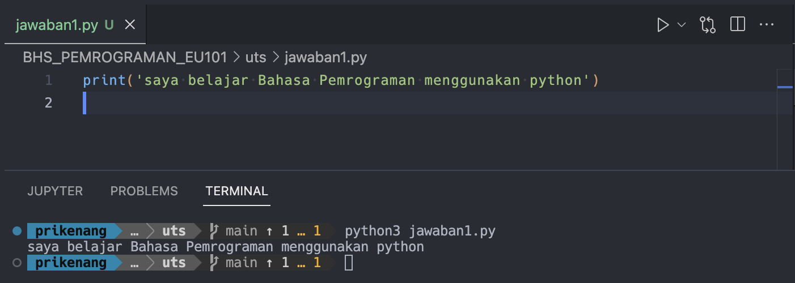
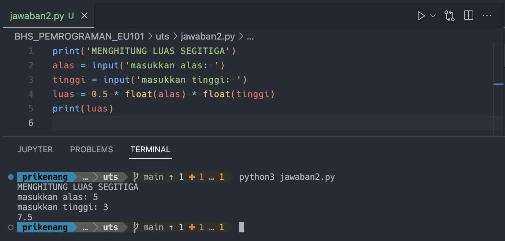
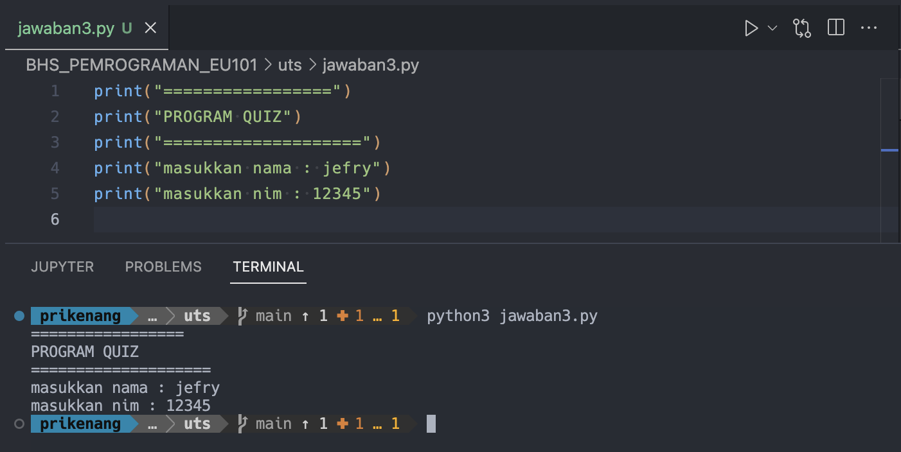
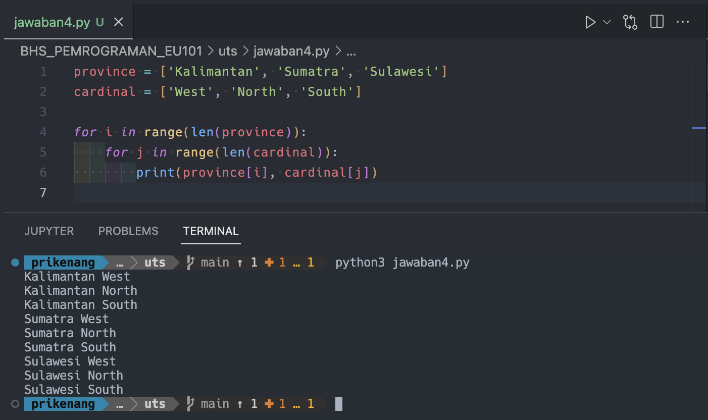
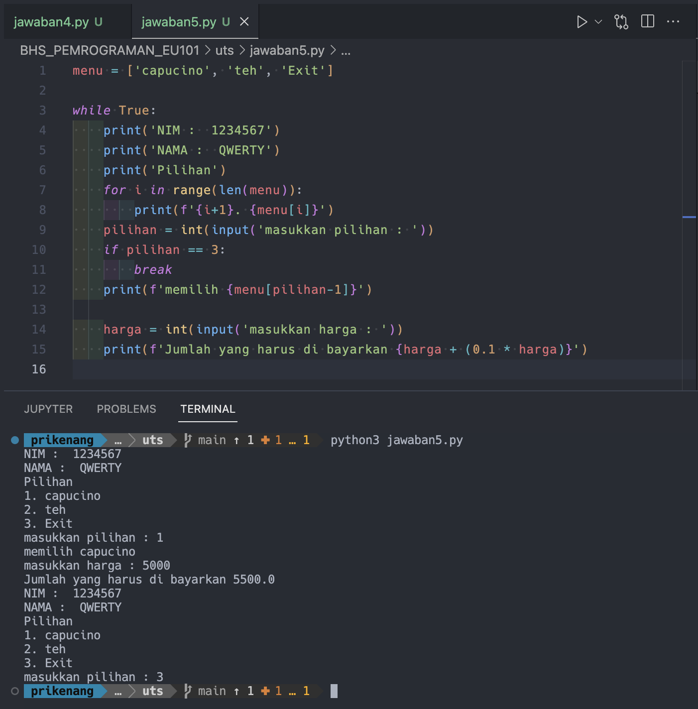

Ujian Tengah Semester

1. [source code](jawaban1.py)

---

2. [source code](jawaban2.py)

---

3. [source code](jawaban3.py)

---

4. [source code](jawaban4.py)

---

5. [source code](jawaban5.py)

