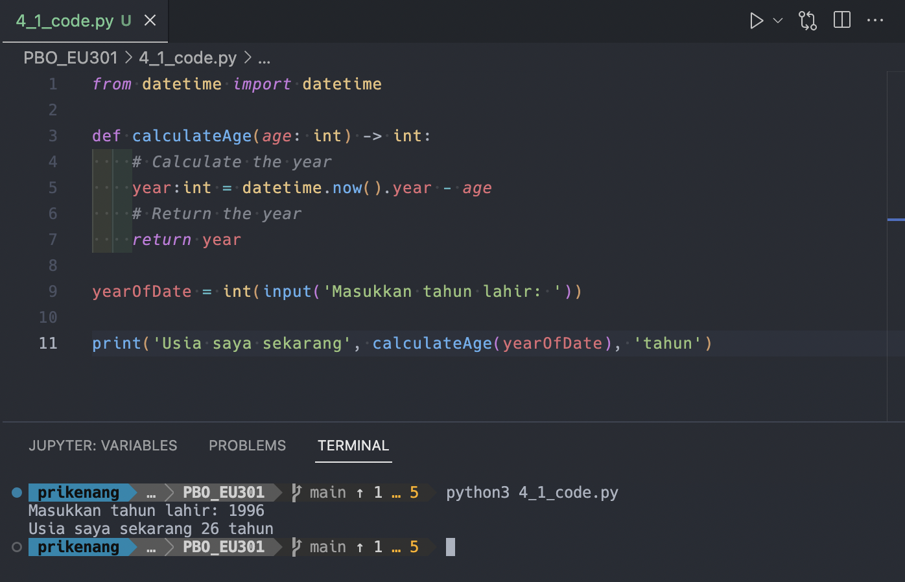
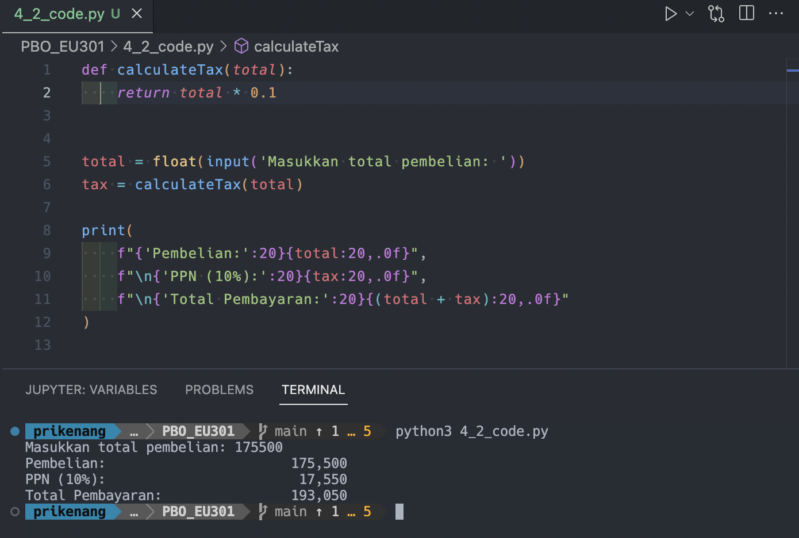

# Fungsi dan Prosedur

1. Menghitung usia berdasarkan tahun lahir dan tahun sekarang

[source code](4_1_code.py)

2. Menghitung Pajak Pertambahan Nilai (PPN) yaitu sebesar 10% dari total pembelian

[source code](4_2_code.py)

