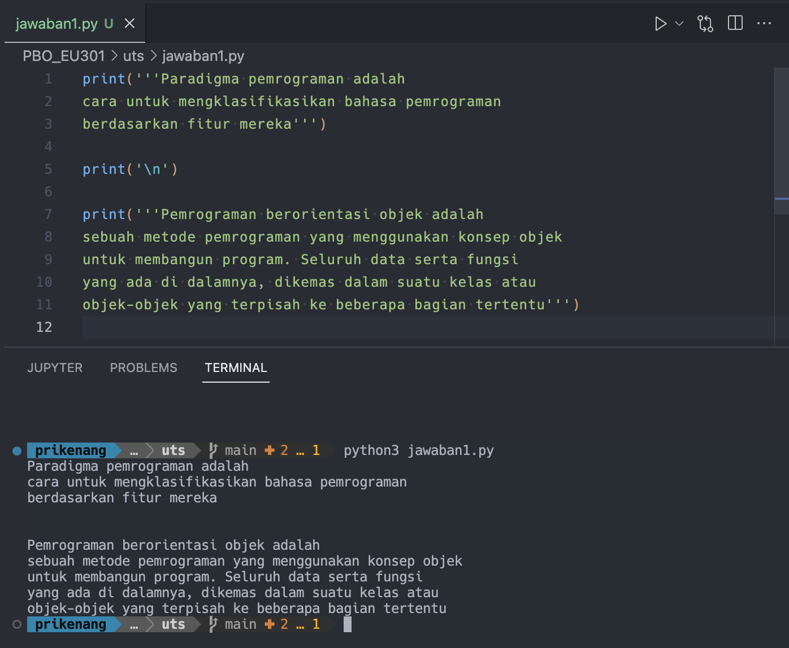
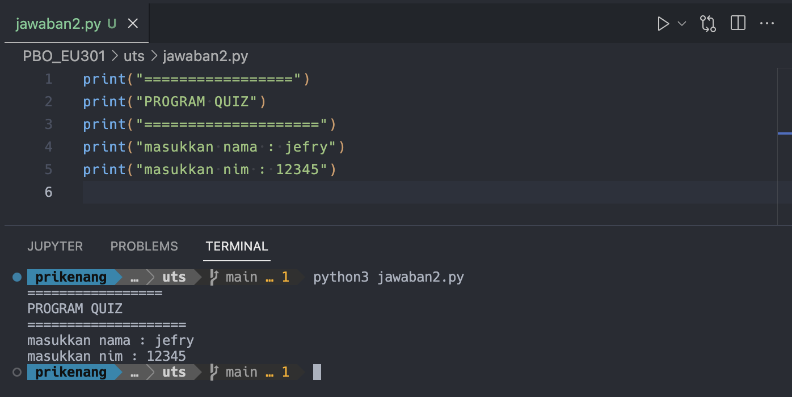
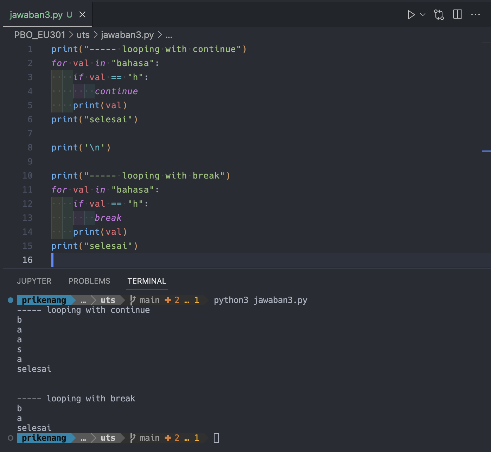
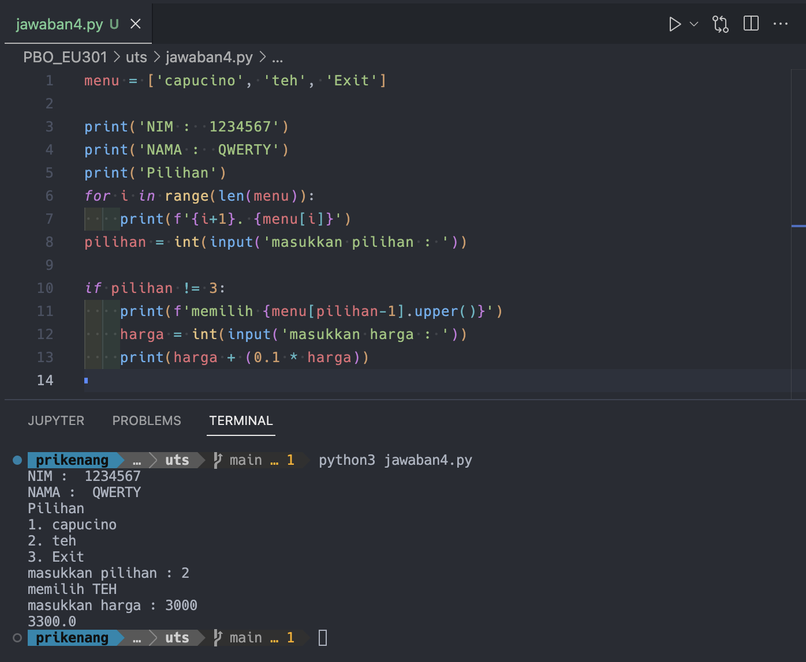
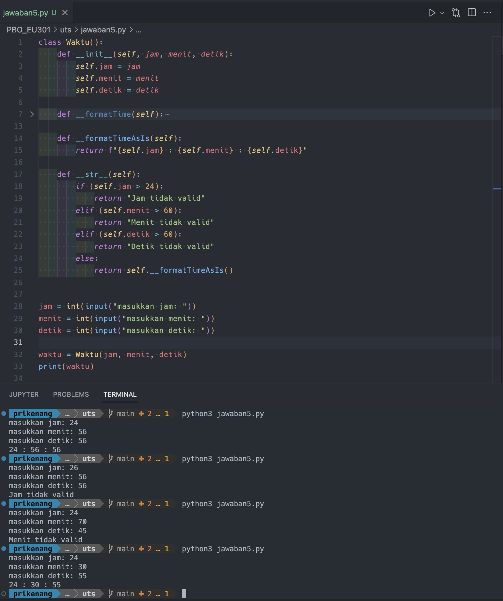

### Ujian Tengah Semester

1. [source code](jawaban1.py)

---

2. [source code](jawaban2.py)

---

3. Ketika di dalam sebuah perulangan terdapat `continue`, maka perulangan tersebut akan dilewati dan dilanjutkan ke perulangan selanjutnya. Sebaliknya, apabila ditemui `break` maka program akan keluar dari perulangan tersebut tanpa diselesaikan.

[source code](jawaban3.py)

---

4. [source code](jawaban4.py)

---

5. [source code](jawaban5.py)

